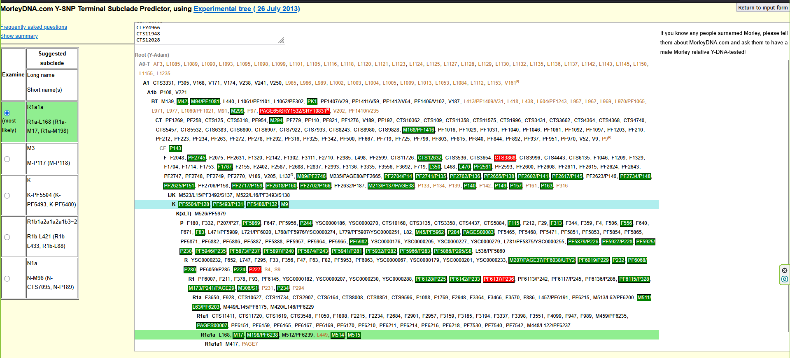
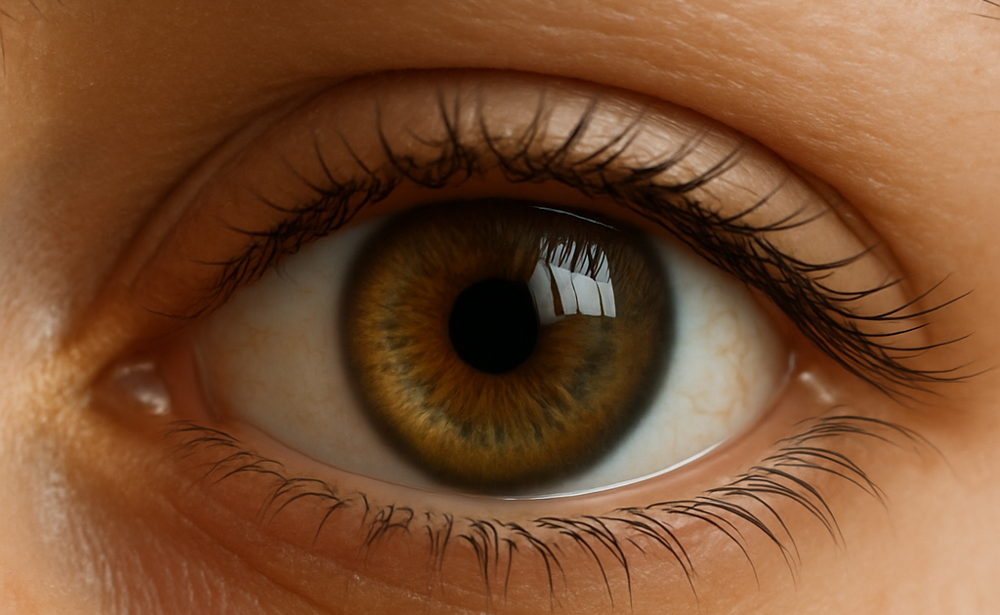

# H+

## Step 1. Data download and preparing

"We will work with raw 23andMe data. “Fix your teacher”: my own data (yes, I decided to release it for class purposes) - 23andMe and Genotek."

 Our raw data looks like this for now:
```
# rsid	chromosome	position	genotype
rs12564807	1	734462	AA
rs3131972	1	752721	AG
rs148828841	1	760998	CC
rs12124819	1	776546	AA
```
"Each line corresponds to a single SNP.  For each SNP, we provide its identifier  (an rsid or an internal id), its location on the reference human genome, and the  genotype call oriented with respect to the plus strand on the human reference sequence."

Firstly we need to convert raw data into vcf format, removing all SNPs corresponding to deletions and insertions, using [plink](https://www.cog-genomics.org/plink/) 

`plink --23file SNP_raw_v4_Full_20170514175358.txt --recode vcf --out snps_clean --output-chr MT --snps-only just-acgt`

Check mitochondrial (MT) and Y-chromosome SNPs:

```
grep -w "Y" snps_clean.vcf | head   # Paternal haplogroup (Y-DNA)
> 595401

grep -w "MT" snps_clean.vcf | head  # Maternal haplogroup (mtDNA)
MT      3       i4001200        T       .       .       .       PR      GT      0/0
MT      7       i4001110        A       .       .       .       PR      GT      0/0
MT      9       i4001358        G       .       .       .       PR      GT      0/0
MT      26      i4000553        C       .       .       .       PR      GT      0/0
MT      40      i4001079        T       .       .       .       PR      GT      0/0
MT      41      i4001190        C       .       .       .       PR      GT      0/0
MT      43      i4000964        C       .       .       .       PR      GT      0/0
MT      46      i4001177        T       .       .       .       PR      GT      0/0
MT      49      i4000987        A       .       .       .       PR      GT      0/0
```
With the command below extract only lines with 'X' and looking for heterozygous SNPs (0/1 or 1/0).

 Python [script](basic_info.ipynb) that thoroughly checks heterozygosity per chromosome from our VCF file. output:

```
            Heterozygous_Count  Total_SNPs  Heterozygosity_Percent
Chromosome                                                        
1                        13408       46440               28.871662
10                        8769       29171               30.060677
11                        7898       29040               27.196970
12                        8206       28343               28.952475
13                        6105       21189               28.812119
14                        5406       18638               29.005258
15                        4996       18058               27.666408
16                        5336       19111               27.921093
17                        4624       17956               25.751838
18                        4985       16480               30.248786
19                        3293       12994               25.342466
2                        13480       45743               29.468990
20                        4412       14486               30.456993
21                        2440        8450               28.875740
22                        2575        8972               28.700401
3                        11231       38252               29.360556
4                        10359       33852               30.600851
5                        10398       34361               30.261052
6                        11578       40180               28.815331
7                         8787       32740               26.838729
8                         8653       30233               28.621043
9                         7596       26583               28.574653
MT                           0        3286                0.000000
X                          103       18759                0.549070
Y                            0        2084                0.000000

```
We have very low heterozygosity for X chromosome (~0.55%), practically close to zero.Thus, the result (~0.55%) clearly and strongly indicates a male genome.

## Step 2.  Determine Ancestry and Haplogroups
Determining maternal (mtDNA) Haplogroup using [James Lick mtDNA Haplogroup Analysis](https://dna.jameslick.com/mthap/).

Summary of an output:

- Most likely haplogroup: H(T152C)
- Key markers present in your mtDNA: 152C, 263G, 750G, 1438G, 4769G, 8860G
- Missing marker (untested): 15326
- Haplogroup H is the most common mtDNA haplogroup in Europe. It is prevalent in Western Europe and associated historically with populations migrating into Europe during and after the last Ice Age.

Determining paternal (Y chromosome) Haplogroup: Use Y-chromosome analysis tools [MorleyDNA](https://ytree.morleydna.com/extractFromAutosomal)

Summary of an output:

- Most Likely Y-Haplogroup: R1a1a (R1a-M17, R1a-M198)
- R1a1a is common in Eastern European and South Asian populations, historically associated with Indo-European migrations.
- The presence of Y-specific SNP markers (M17, M198, and M417) directly confirms the biological sex as male.
  
## Step 3. Phenotype Annotation (Sex, Eye Color, Traits)
we will do eye-color analysis based on the provided [article](https://www.ncbi.nlm.nih.gov/pmc/articles/PMC3694299/). The relevant SNPs are clearly stated:

    rs12913832 (HERC2)

    rs16891982 (SLC45A2)

    rs12203592 (IRF4)

    rs6119471 (ASIP)

    rs12896399 (SLC24A4) (the new SNP added in 8-plex system)

 Prediction method:
 1. rs12913832 (HERC2):

    - A/A or G/A → NOT blue (brown or green)
    - G/G → NOT brown (green or blue)
2. Brown eyes: (A/A or G/A at rs12913832) AND (G/G at rs6119471 OR C/C at rs16891982)
    - Green eyes: (G/G at rs12913832 and C/C at rs16891982) OR (G/A at rs12913832 and T/T at rs12203592)
    - Blue eyes: G/G at rs12913832 and T/T at rs12203592
    - Brown eyes if A/A at rs12913832 AND G/G at rs12896399
    - Blue eyes if G/G at rs12913832 AND T/T at rs12896399


`grep -w -E "rs12913832|rs16891982|rs12203592|rs6119471|rs12896399" snps_clean.vcf`

```
5       33951693        rs16891982      C       G       .       .       PR      GT      0/1
6       396321  rs12203592      C       T       .       .       PR      GT      0/1
14      92773663        rs12896399      G       .       .       .       PR      GT      0/0
15      28365618        rs12913832      A       G       .       .       PR      GT      0/1
```
Summary genotype:
- rs12913832 (HERC2): A/G (0/1)
- rs16891982 (SLC45A2): C/G (0/1)
- rs12203592 (IRF4): C/T (0/1)
- rs12896399 (SLC24A4): G/G (0/0)
- rs6119471 (ASIP): Not provided

Lets use simple python [script](<eye_predict.py>) to analyse our SNP presented and applying rule.

> Predicted eye color: Not blue (Brown or Green)
> 
Well, based on data it's complicated to be sure on 100% exact eye color. It's **not blue** bu hard to distinguish between brown or green eyes because it's heterozygous at key SNP positions, and rs6119471 is missing. With help of ChatGPT [(Sora)](https://sora.chatgpt.com/library) we can imagine the eye color:



Another way of predicting eye0color is using [HIrisPlex-S Eye, Hair and Skin Colour DNA Phenotyping Webtool](https://hirisplex.erasmusmc.nl/)
The result are presented in files: [IrisPlex.csv]() and [HIrisPlexS.csv]() 
## Step 4. Clinical annotation and SNP exploration
Clinical annotation involves linking genetic variants (SNPs from genome data) to their known medical significance or biological effects, particularly regarding diseases or clinical traits. SnpEff: annotates our SNPs with biological context (location in the gene, type of mutation, impact on protein). SnpSift: annotates with clinical data from databases such as ClinVar (clinical variants) or GWAS Catalog (Genome-Wide Association Studies). Below the row of command will perform clinical annotation.

```
java -jar ./snpEff.jar GRCh37.75 snps_clean.vcf > snps_snpeff.vcf
wget https://ftp.ncbi.nlm.nih.gov/pub/clinvar/vcf_GRCh37/clinvar.vcf.gz
sudo apt-get install tabix
tabix -p vcf clinvar.vcf.gz
java -jar SnpSift.jar annotate clinvar.vcf.gz snps_clean.vcf > snps_clean_clinvar.vcf
```

Our annotated file (snps_clean_clinvar.vcf) contains clinical annotations (CLNDN) describing diseases or clinical traits. We will save it in separate file for further analysis, having this structure: Chromosome, Position, SNP ID (rsID), and clinical description (CLNDN).   
`grep -v "^#" snps_clean_clinvar.vcf | grep "CLNDN" | cut -f1,2,3,8 > clinically_relevant_snps.txt`

There are a lot of "not provided" entries, so we will filter them and keep only informative one:   
`grep "CLNDN" snps_clean_clinvar.vcf | grep -v "not_provided" > clinically_relevant_snps_filtered.txt`   

GWAS Catalog helps associate SNPs with traits identified through Genome-Wide Association Studies:
1. Download GWAS Catalog data:   
   `wget https://www.ebi.ac.uk/gwas/api/search/downloads/full -O gwas_catalog.tsv`
2. Annotate your VCF file using SnpSift:   
   `java -jar SnpSift.jar gwasCat -db gwas_catalog.tsv snps_clean.vcf > snps_clean_gwascat.vcf`
3. Extract interesting GWAS associations:    
   `grep -v "^#" snps_clean_gwascat.vcf | grep "GWASCAT_TRAIT" | cut -f1,2,3,8 > gwas_trait_associations.txt`

Let us work a little with annotated output - [clinically_relevant_snps_filtered.txt]()

In the VCF file, clinical significance of SNPs is indicated by the CLNSIG field in the INFO column:

    Pathogenic – associated clearly with a disease.

    Likely_pathogenic – likely associated.

    Risk_factor – increases susceptibility to a disease.

    Association – associated statistically with a condition.

    Benign – not clinically relevant.

We should extract SNPs explicitly marked as clinically significant:

    Pathogenic

    Likely_pathogenic

    Risk_factor

    Association

With simple python [script](Clinical_snp.ipynb) we recieved this [output](clinically_relevant_snps.csv) with 19  clinically significant SNPs

## Step 5. Genome editing plan

We will look at one example of SNP here and provide table with 5 SNPs' edits in [LabReport](https://docs.google.com/document/d/1vkfhVK8wfpDMmIXQg0GRD4fa8KtQgi5trRayrzgPFq0/edit?tab=t.0).

```
Chromosome: 1
Position: 31349647
rsID: rs2491132
REF (reference allele): C
ALT (alternate allele): T
Genotype: 0/1
```
 The alternate allele (T) is associated with "Obesity", so we'd like to reduce obesity risk. In that case, we would replace the alternate allele (T) with the reference allele (C) on the chromosome copy that has the risk variant. 

## P.S. Pipeline with analyzing unique from both Genotek vcf + 23andMe data is representes in [eye_snp.ipynb]()

The work was performed by Kochubei Lisa and Mikhaylov Roman